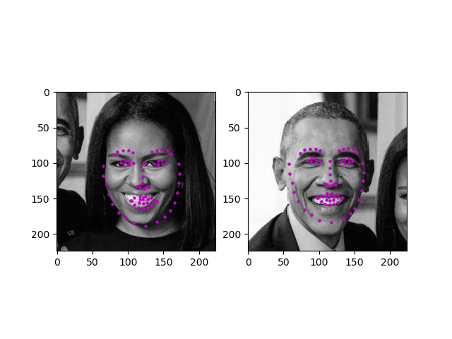
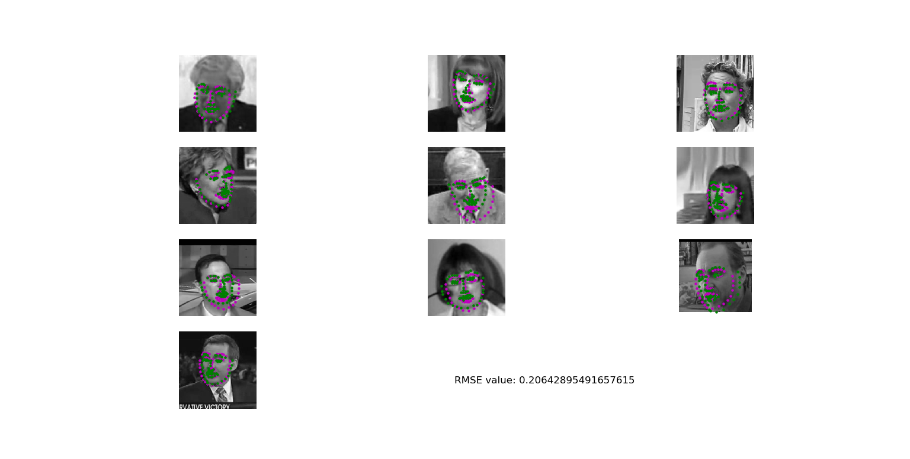
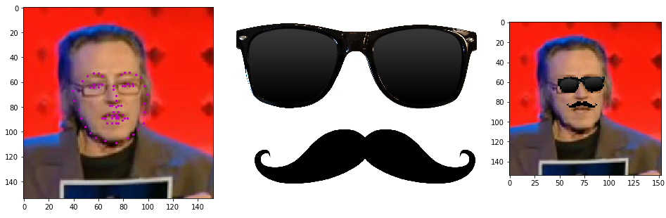

[//]: # (Image References)

[image1]: ./images/key_pts_example.png "Facial Keypoint Detection"

# Facial Keypoint Detection
## Accomplished as a required project for Udacity Computer Vision Nanodegree 

## Project Overview
### Results are not generated from the model that has been trained. Thus, results might not be same.

This is the first project from the course. In this project, 
computer vision techniques and deep learning architectures are used together to build a facial keypoint detection system. Facial keypoints include points 
around the eyes, nose, and mouth on a face and are used in many applications. These applications include: facial tracking, facial pose recognition, facial filters, 
and emotion recognition. Your completed code should be able to look at any image, detect faces, and predict the locations of facial keypoints on each face; examples of 
these keypoints are displayed below.

__NB__ This project has been further extended in Python & Tensorflow with C++ interface. The scope of
 the extended project is not limited to facial keypoint detection only. Furthermore, the
  extended project has also been deployed on Android mobile.  

<p align="center">
  
</p>

---
- To run training, use the *run_face_keypoint_detector_trainer.py* with arguments.
- To run complete test on a saved pre-trained model, run *run_complete_test_pipeline.py* with arguments.

*The jupyter notebooks for the project submission are also included. The files are:  * 

__Notebook 1__ : Loading and Visualizing the Facial Keypoint Data

__Notebook 2__ : Defining and Training a Convolutional Neural Network (CNN) to Predict Facial Keypoints

__Notebook 3__ : Facial Keypoint Detection Using Haar Cascades and the Trained CNN

__Notebook 4__ : Fun Filters and Keypoint Uses


*Note that as per instruction, this project does not use GPU.*


### Local Environment Instructions

1. Clone the repository, and navigate to the downloaded folder. This may take a minute or two to clone due to the included image data.
```
git clone https://github.com/alarafat/facial_keypoint_detection.git
cd facial_keypoint_detection
```

2. Create (and activate) a new environment named `cv-nd` with all the required packages, 
run the 'create_and_set_environment.bat' file. If prompted to proceed with the install `(Proceed [y]/n)` type y.
```shell
create_and_set_environment.bat
proceeed with [y]

### Environemnt
The bat file will create a conda environment usinf python 3.6 with the required pip and conda packages
specified in the requirement files in /requirements subdirectory.


### Data

All of the data you'll need to train a neural network is in the P1_Facial_Keypoints repo, in the subdirectory `data`. In this folder are training and tests set of image/keypoint data, and their respective csv files. This will be further explored in Notebook 1: Loading and Visualizing Data, and you're encouraged to look trough these folders on your own, too.

```

2. Open the directory of notebooks, run the 'run_notebook.bat' file. This file will activate the conda environment `cv-nd`
and open the notebook in the browser. Open the notebooks and follow the instructions.
```shell
run_notebook.bat
```

**Results**

<p align="center">
  
</p>

**Fun Results**
<p align="center">
  
</p>
